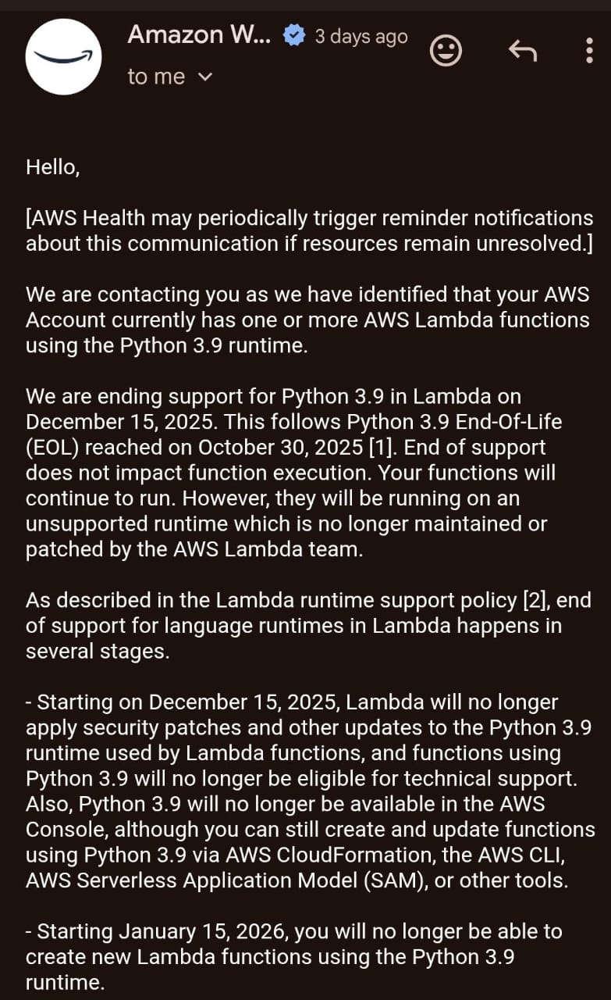
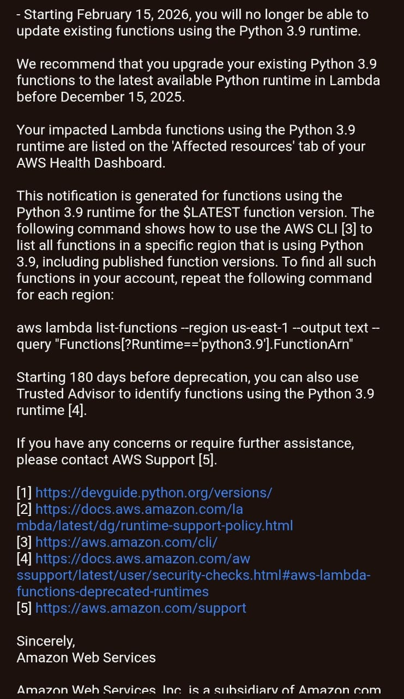

✅Week 10 Mentorship Project – Group B

✅GROUP B TEAM: Fagoroye Sanumi O.
                 & Lawal Jonathan
               
**TOPIC**: Automate maintenance of Lambda functions by identifying and updating outdated runtimes.

This project helps you automatically detect and update AWS Lambda functions that are using outdated runtimes — like python3.9 or nodejs12.x — and upgrade them to supported versions such as python3.11 or nodejs20.x.

Whether you're preparing for AWS deprecation deadlines or maintaining security compliance, this tool ensures your Lambda functions stay up-to-date with minimal effort.

# Why Runtime Upgrades Matter

AWS periodically deprecates old runtimes. Continuing to use them can lead to:

❌ Inability to create new functions or update existing ones.

🛑 Removal of critical security patches and updates.

⚠️ Application outages if AWS drops support unexpectedly.

# 🔍 Features

- Lists all Lambda functions in an AWS region.

- Filters for outdated runtimes.

- Supports dry-run mode.

- Generates `before.json` and `after.json` reports.

- Includes logging and CLI flags.

# ⚠️ Runtime Support Policy

AWS regularly deprecates older Lambda runtimes. When a runtime is deprecated:

- You can no longer create new functions using it.

- You must update existing functions before they are removed.

- Deprecated runtimes eventually stop receiving security updates.

AWS periodically deprecates old Lambda runtimes. Learn more:  
🔗 https://docs.aws.amazon.com/lambda/latest/dg/runtime-support-policy.html

# Output Reports

After execution, two JSON files are generated in /tmp (in Lambda) or your local system:

before.json: List of outdated functions with their current runtimes.

after.json: List of updated functions and new runtimes applied.

Example: 

[
  {
    "FunctionName": "imageProcessor",
    "OldRuntime": "python3.9",
    "NewRuntime": "python3.11"
  }
]

# Deploy as an AWS Lambda Function

Package the script as a Lambda.

Set the handler to upgrade_runtime.lambda_handler.

Schedule it using EventBridge (cron).

Check CloudWatch Logs for detailed output.

